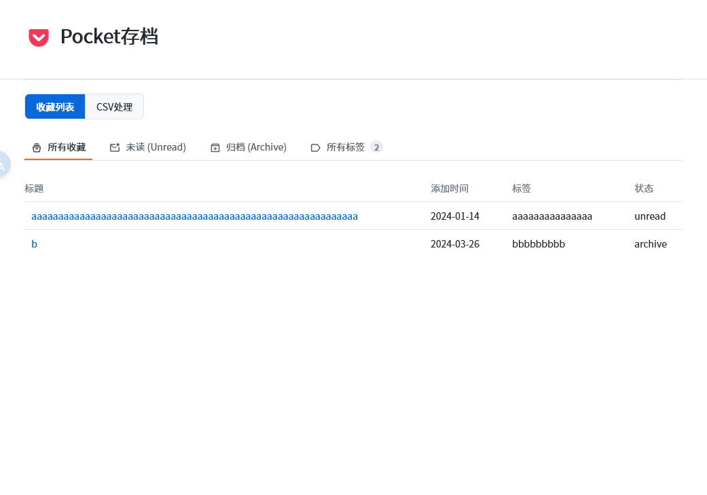
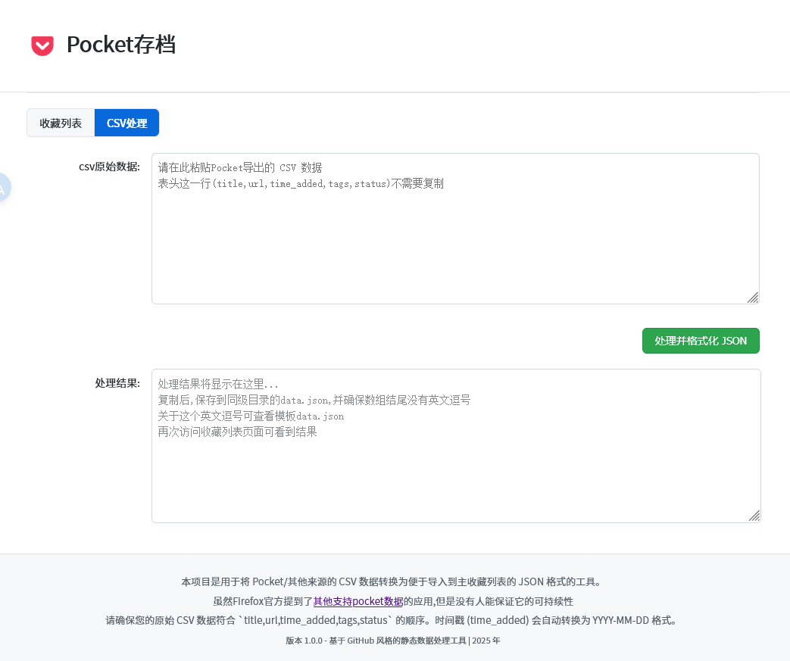

# firefox pocket关闭服务器
- 2025 年 5 月 22 日禁止商店新用户下载app
  - 2025 年 7 月 8 日服务终止,2025 年 10 月 8日前可登录导出,之后，所有用户数据将被永久删除
  - 在 2025 年 11 月 12 日之前导出所有文章，包括清单、归档内容、收藏夹、笔记以及高亮标注。在此日期之后，所有用户账户及数据将被永久删除。
- 官方推荐了一部分第三方支持pocket csv的应用,但是 可持续性,网络访问难易,同步延迟这些都无从得知
- 最主要的是 Mozilla关闭到停止支持导出 竟然只给了3~4个月的时间,而且并没有收到任何邮件通知说服务即将关闭
- 查看官方的说明也会很明显的感觉到异常:到底是10 月 8日还是11 月 12 日停止导出

# 离线csv界面
- 在CSV处理界面粘贴导出的pocket数据
  - 将得到的json文本粘贴,全文覆盖到data.json,保存
    - 切换到收藏列表得到结果
- 仿GitHub风格

# 预览

